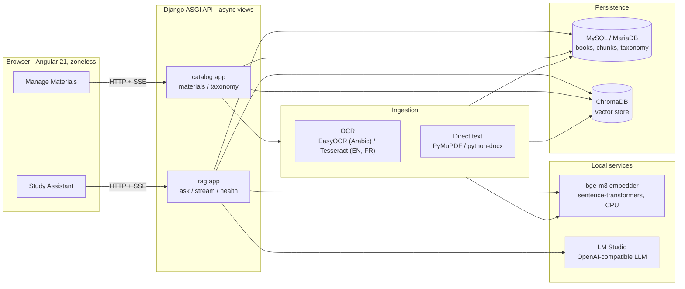
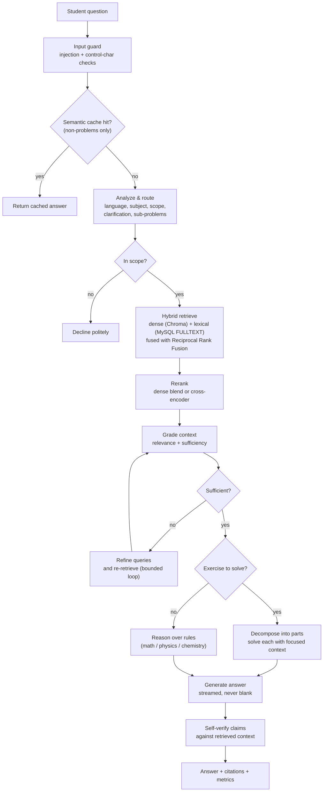
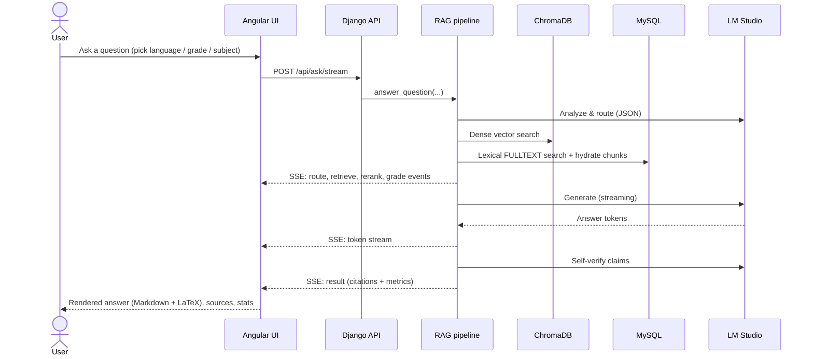
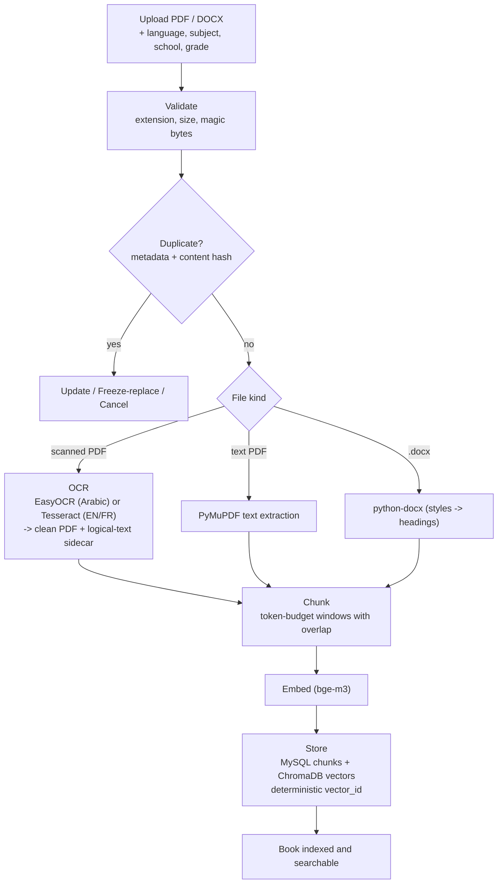
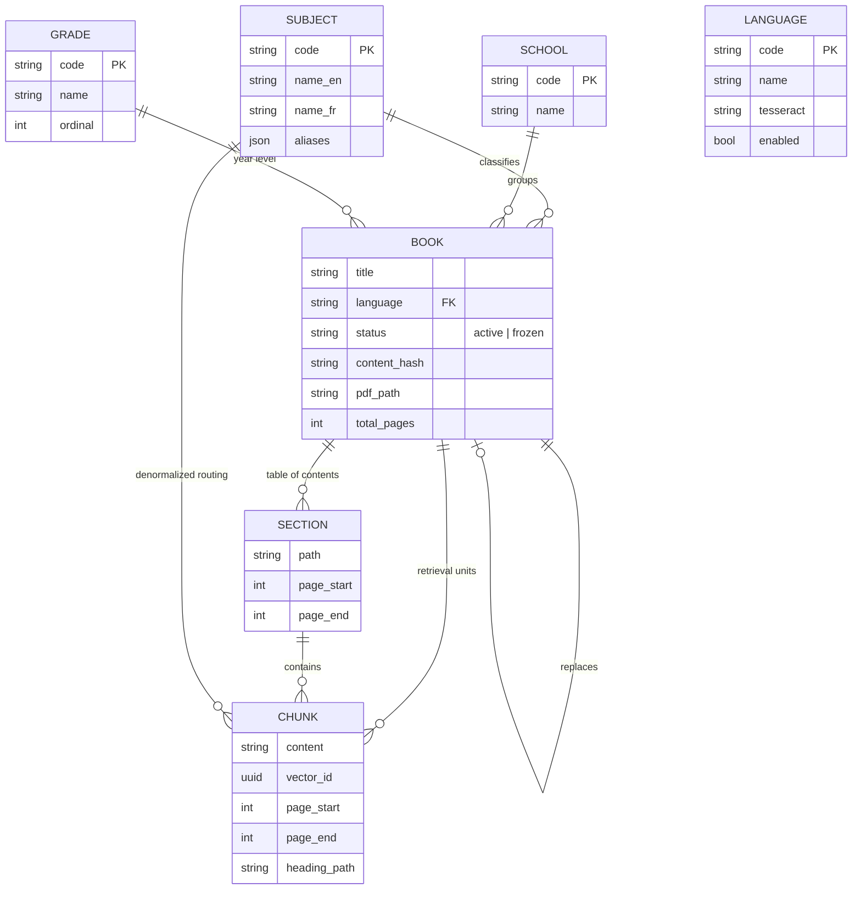

# Brevet-GPT

A fully local, retrieval-augmented study assistant for the Lebanese **Brevet** (Grade 9) curriculum. Students ask questions in **English, French, or Arabic**; the system answers strictly from the official textbooks, with citations, step-by-step problem solving, and source transparency. A second screen lets an operator grow and curate the corpus — upload a PDF or Word document, have it OCR'd, chunked, embedded, de-duplicated, and indexed — without touching the command line.

Everything runs on your own machine: a local embedding model, a local vector store, and a local LLM. No data leaves the host.


-000000)


---

## Table of contents

- [Highlights](#highlights)
- [System architecture](#system-architecture)
- [How a question is answered](#how-a-question-is-answered)
- [Query lifecycle](#query-lifecycle)
- [Ingestion pipeline](#ingestion-pipeline)
- [Data model](#data-model)
- [Technology stack](#technology-stack)
- [The two screens](#the-two-screens)
- [Getting started](#getting-started)
- [Configuration](#configuration)
- [Management commands](#management-commands)
- [HTTP API](#http-api)
- [Project structure](#project-structure)
- [Design notes and limitations](#design-notes-and-limitations)
- [License](#license)

---

## Highlights

| Area | What it does |
| --- | --- |
| **Grounded answers** | Hybrid retrieval (dense + lexical) over the textbook corpus; the model is constrained to the retrieved context and cites every source `[n]`. |
| **Agentic RAG** | Route, retrieve, rerank, grade context, refine on weak matches, then either solve or reason, generate, and self-verify — each step bounded by a hard LLM-call budget. |
| **Problem solving** | Multi-part exercises are decomposed into sub-problems and solved one at a time with a small, focused context — robust even on small local models. |
| **Trilingual** | English, French, and Arabic end to end: language detection, routing, prompts, right-to-left rendering, and Arabic-aware OCR. |
| **Corpus management UI** | Upload PDF/DOCX with routing metadata; smart per-file parsing (OCR vs. direct text); duplicate detection; update / freeze-and-replace / freeze; browse and search. |
| **Classification** | Books are organized by School, Grade, Subject, and Language; retrieval can be scoped to a grade, and frozen books are excluded from answers without being deleted. |
| **Streaming UX** | Server-Sent Events stream the pipeline's reasoning, tokens, citations, and timing metrics live to the browser. |
| **Local and private** | CPU embeddings (`bge-m3`), an embedded vector store (ChromaDB), and a local OpenAI-compatible LLM (LM Studio). No external API required. |

---

## System architecture



The relational database is the system of record for the corpus and routing metadata. The vector store holds only embeddings keyed by a deterministic `vector_id`, so the database can always be rebuilt or reconciled with the index.

---

## How a question is answered

The agentic pipeline is a sequence of bounded, individually switchable stages. A weak match triggers query refinement; an exercise triggers the solve branch; everything else flows to the tutor-style generator.



Frozen books and out-of-grade books are excluded at every retrieval layer, so disabling a book or scoping to a grade is a pure metadata operation — no re-indexing required.

---

## Query lifecycle



---

## Ingestion pipeline

Uploads are parsed by file type. Scanned PDFs are OCR'd into a clean, structured PDF plus a logical-text sidecar; text-layer PDFs and Word documents are read directly. All paths converge on the same token-window chunker and embedder.



The OCR engine produces a sidecar of logical (reading-order) text used for embedding, so the search index is never derived from a re-extracted PDF text layer — which is essential for correct Arabic, where bidirectional reordering would otherwise corrupt the text.

---

## Data model



`Language` is a runtime-extensible registry; `Book.language` and `Chunk.language` store its `code`. Adding a language (or subject, school, grade) is a data operation, available both from the seed command and from the Manage Materials UI.

---

## Technology stack

| Layer | Technology |
| --- | --- |
| Frontend | Angular 21 (standalone components, zoneless / signals), `marked`, KaTeX, DOMPurify |
| API | Django 4.2 LTS, async views over ASGI (`uvicorn`), Server-Sent Events |
| Relational store | MySQL / MariaDB (`utf8mb4`), with a FULLTEXT index for lexical search |
| Vector store | ChromaDB (embedded, persistent) |
| Embeddings | `BAAI/bge-m3` via `sentence-transformers` (CPU by default); optional OpenAI backend |
| Generation | Any OpenAI-compatible local server via LM Studio (for example a Qwen3 model) |
| OCR | EasyOCR (Arabic), Tesseract 5 (English/French) via PyMuPDF rasterization |
| Document parsing | PyMuPDF (PDF text), `python-docx` (Word) |

---

## The two screens

**Study Assistant.** Ask a question, optionally constraining language, subject, and grade. The interface streams a live "thinking" log, the answer (rendered as Markdown with LaTeX math), expandable source cards with page citations, and per-query metrics (latency breakdown, tokens, throughput, relevance, verification). A Stop control aborts an in-flight query.

**Manage Materials.** Upload a PDF or Word document with routing metadata, and watch OCR/parse, chunk, embed, and store progress stream in. Duplicate detection offers Update, Freeze-and-replace, or Cancel. The library lists every book with status badges and lineage; rows can be frozen (excluded from answers but retained), unfrozen, or deleted. Books can be browsed chunk-by-chunk, and the corpus can be searched directly. Languages, subjects, schools, and grades each support a "choose existing or add new" control.

---

## Getting started

### Prerequisites

- Python 3.12
- Node.js 20+ and npm
- MySQL or MariaDB (for example via XAMPP), with a `utf8mb4` database
- Tesseract OCR 5 with the `osd`, `eng`, and `fra` language data (Arabic uses EasyOCR, installed via pip)
- [LM Studio](https://lmstudio.ai/) running a chat model on its local server

LM Studio, the database, and ChromaDB are external services; the launcher does not start or modify them.

### Backend

```bash
cd backend
python -m venv .venv
.venv\Scripts\activate            # Windows  (use: source .venv/bin/activate on macOS/Linux)

pip install -r requirements.txt           # web/API
pip install -r requirements-ingest.txt    # OCR + embeddings + ingestion

copy .env.example .env                     # then edit DB credentials and LM Studio URL
python manage.py migrate
python manage.py seed                      # subject taxonomy + corpus scan
```

Populate the index from your scanned textbooks (interactive, one book at a time):

```bash
python manage.py ocr_embed
```

Run the async API:

```bash
python manage.py brevet                    # serves http://localhost:8000
```

### Frontend

```bash
cd frontend
npm install
npm start                                  # serves http://localhost:4200
```

### One-step launch (Windows)

From the repository root:

```powershell
.\start.ps1 -Open
```

This opens the backend and frontend in separate windows and launches the browser once the UI is ready.

---

## Configuration

All settings are read from `backend/.env` (see `backend/.env.example` for the complete, commented list). Storage paths default to project-root-relative directories so the repository is portable across machines.

| Variable | Default | Purpose |
| --- | --- | --- |
| `DB_NAME` / `DB_USER` / `DB_PASSWORD` | — | MySQL/MariaDB connection |
| `LMSTUDIO_BASE_URL` | `http://localhost:1234/v1` | Local LLM endpoint |
| `LMSTUDIO_MODEL` | auto-detect | Model id (blank uses the loaded model) |
| `EMBEDDING_BACKEND` | `local` | `local` (bge-m3, CPU) or `openai` |
| `CHROMA_DIR` | `<repo>/chroma` | Vector store location |
| `ASSETS_DIR` / `RESULTS_DIR` / `UPLOADS_DIR` | `<repo>/...` | Corpus source, OCR output, uploads |
| `RAG_AGENTIC` | `true` | Agentic pipeline (vs. the linear baseline) |
| `RAG_TOP_K` | `6` | Chunks in the final context |
| `RAG_MIN_RELEVANCE` | `0.25` | Below this, the system declines as off-topic |
| `RAG_RERANK_BACKEND` | `dense` | `dense`, `cross_encoder`, or `none` |
| `RAG_SOLVE` | `true` | Decompose-and-solve for multi-part exercises |
| `RAG_CACHE` | `true` | Semantic answer cache |
| `MAX_UPLOAD_MB` | `100` | Upload size cap |

The agentic stages (grading, refine loop, reasoning, verification, scope guard, clarification) and the per-answer LLM-call budget are each individually configurable.

---

## Management commands

Run from `backend/` with the virtual environment active.

| Command | Description |
| --- | --- |
| `python manage.py seed` | Seed the subject taxonomy and scan the corpus into book records (idempotent). |
| `python manage.py ocr_embed` | Interactively OCR a single scanned book and embed it (routing -> MySQL + ChromaDB). |
| `python manage.py embed_books` | Embed already-OCR'd structured PDFs across the corpus. |
| `python manage.py chunk_health` | Diagnostics over chunk sizes, coverage, and index health. |
| `python manage.py brevet` | Run the async API server (ASGI / uvicorn). |
| `python manage.py ask "question"` | Ask a question from the command line. |
| `python manage.py rag_eval` | Run the evaluation harness and report retrieval/answer metrics. |

---

## HTTP API

### Study (rag app)

| Method | Path | Description |
| --- | --- | --- |
| `POST` | `/api/ask` | Answer a question; returns JSON with answer, citations, and metrics. |
| `POST` | `/api/ask/stream` | Same, streamed as Server-Sent Events (logs, tokens, result). |
| `GET` | `/api/health` | Liveness of the LLM, vector store, and corpus counts. |

Request body: `{ "question": "...", "language?": "en|fr|ar", "subject?": "...", "grade?": "g9" }`.

### Corpus (catalog app)

| Method | Path | Description |
| --- | --- | --- |
| `GET` | `/api/taxonomy` | Languages, schools, grades, and subjects for the UI. |
| `POST` | `/api/taxonomy` | Create (or reuse) a routing term: `{ kind, name }`. |
| `GET` | `/api/materials` | List books with filters (status, subject, language, grade, query). |
| `POST` | `/api/materials/check` | Cheap duplicate pre-check before upload. |
| `POST` | `/api/materials/upload` | Multipart upload; OCR/parse/embed progress streamed as SSE. |
| `GET` | `/api/materials/{id}` | Book detail with paginated chunk browsing. |
| `DELETE` | `/api/materials/{id}` | Remove a book, its chunks, and its vectors. |
| `POST` | `/api/materials/{id}/freeze` · `/unfreeze` | Toggle a book's retrieval status. |
| `POST` | `/api/materials/search` | Search the active corpus directly. |

---

## Project structure

```
Brevet-gpt/
├─ backend/
│  ├─ apps/
│  │  ├─ catalog/              # corpus, taxonomy, ingestion
│  │  │  ├─ models.py          # Subject, Language, School, Grade, Book, Section, Chunk
│  │  │  ├─ services/          # ocr, intake, chunking, embeddings, ingest, materials, vectorstore
│  │  │  └─ management/commands/  # seed, ocr_embed, embed_books, chunk_health
│  │  └─ rag/                  # retrieval and answering
│  │     ├─ services/          # pipeline, agent, retrieval, reformulation, grading, verify,
│  │     │                     # rerank, prompts, guard, llm, cache, embeddings
│  │     └─ management/commands/  # ask, brevet, rag_eval
│  ├─ config/                  # settings (base/local), urls, asgi, wsgi
│  ├─ requirements.txt         # web/API dependencies
│  └─ requirements-ingest.txt  # OCR + embeddings + ingestion dependencies
├─ frontend/                   # Angular 21 app (Study Assistant + Manage Materials)
│  └─ src/app/                 # app, brevet.service, materials.service, manage.component, format
├─ gpu_ocr_books.py            # OCR engine: scanned PDF -> clean structured PDF + text sidecar
├─ start.ps1                   # launcher (backend + frontend)
└─ README.md
```

Generated artifacts (`assets/`, `results/`, `uploads/`, `chroma/`, `tessdata/`) and secrets (`.env`) are not version-controlled.

---

## Design notes and limitations

- **Grounding over fluency.** When retrieval is weak or off-topic, the system declines rather than inventing an answer. Self-verification checks the answer's claims against the retrieved context.
- **Small-model friendly.** Long multi-part worksheets are decomposed and solved per part with focused context; the pipeline guarantees a non-empty answer and continues responses cut off at the token limit.
- **OCR scope.** Arabic uses EasyOCR (right-to-left, neural) and English/French use Tesseract; reconstructed table-of-contents headings are derived heuristically and are weaker for Arabic. Equations rendered as images are not transcribed.
- **Local-only guarding.** There is no authentication layer; protection is via strict file validation, an input guard, and the grounding constraints. Intended for trusted local or single-tenant deployment.
- **Reranking.** The default reranker reorders by dense similarity (no extra model). A cross-encoder backend is available but loads a second model and needs additional memory.

---

## License

Licensed under the Apache License 2.0. See [LICENSE](LICENSE).
